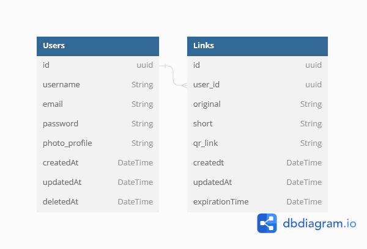

# Pendekin

**Pendekin** is a simple and lightweight link shortener service designed to make your URLs more manageable and user-friendly. With Pendekin, you can easily generate shortened versions of long and complex links, making them concise and easy to share.

## Features

- **Simplicity**: Streamlined and user-friendly interface for quick link shortening.
- **Customization**: Generate custom short URLs for a personalized touch.

## Getting Started

To get started with Pendekin, follow these simple steps:

1. **Install Dependencies**: Run `npm install` to install the necessary dependencies.
2. **Configure Settings**: Adjust the configuration file to tailor Pendekin to your needs.
3. **Start the Server**: Launch the Pendekin server using `npm start`.
4. **Shorten Links**: Use the provided API endpoints or the web interface to generate short links.

## ERD

Feel free to contribute, report issues, or suggest features to make Pendekin even better!

